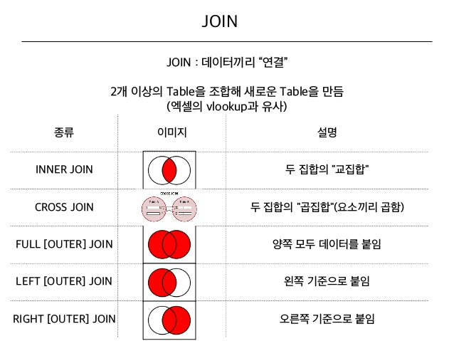

# 5. Join

## RECAP
>- `SELECT`와 `FROM`문을 통해 데이터 추출
>- `WHERE`문을 활용하면 조건에 부합하는 데이터만 추출 (이 때, 조건은 열 기준으로 적용)
>- `GROUP BY`문을 활용하면 엑셀의 피벗테이블 형태로 데이터를 가공한 후 추출 (집계함수 필수)

## SUMMARY
>- 정보가 여러개의 테이블에 나뉘어 저장되어 있어서 복수의 테이블을 하나로 합칠 필요가 있음
>- 이때 `JOIN`문을 사용하면 2개의 테이블을 지정한 열과 기준에 따라 새로운 테이블로 생성
>- 엑셀의 `VLOOKUP`과 유사한 기능이지만, 단일 값을 반환하는 것이 아니라 테이블(열) 전체를 묶어줌

## 1. `JOIN`의 원리
- 명령어를 통해 직관적으로 이해할 수 있듯이 2개의 데이터 세트를 하나로 합치는 명령어임
- JOIN은 `FROM`절에 이어 나오게 되는게 크게 `JOIN`과 `ON`구문로 구성
- `JOIN`은 `FROM`외 병합하고 싶은 데이터세트를 인자로 받음
```sql
FROM
  UserInformation as t1
JOIN
  PlayLog as t2
```
- `ON`은 열 기준로 두 데이터 세트를 합치는 조건을 명기
```sql
on t1.id = t2.id
```
- 통상적으로 같은 값을 가진 열을 병합
- 예를 들어서 고객 정보만 담긴 데이터와 콜정보만 담긴 데이터가 있는데 두 데이터의 공통 분모가 고객의 id라면, 두 데이터테이블에서 값이 같은 열 기준으로 병합 가능

## 2. `LEFT JOIN`과 `RIGHT JOIN`
- 일반적으로 `JOIN` 사용 시 공통 열 기준으로 병합을 진행
- 하지만 상대적으로 더 중요한 테이블의 모든 데이터를 살리고 싶은 경우가 있음
- 예를 들어, 플레이 로그와 유저 정보가 별도의 테이블에 있는데, 플레이 기록이 있는 유저 정보만 파악하고 싶은 경우 `LEFT JOIN` 또는 `RIGHT JOIN` 사용 가능
- 이 때 `LEFT` 또는 `RIGHT`을 지정하여 온전히 가져올 테이블을 지정할 수 있음
```sql
FROM
  UserInformation as t1
RIGHT JOIN
  PlayLog as t2
  ON
    t1.id = t2.id
```
- 위와 같이 쿼리문을 작성 시, `PlayLog`란 테이블은 온전히 가져오되, `PlayLog`에 존재하지 않는 `id`는 `UserInformation`에서 제외하고 가져옴

## 3. `INNER JOIN`과 `OUTER JOIN`
- `LEFT` 또는 `RIGHT`과 매우 흡사하며, `INNER`의 경우 두 테이블에 공통으로 존재하는 교집합을 가져오게 되며, `OUTER`의 경우 각각의 테이블로부터 모든 정보를 가져오게 됨 (합집합 개념)
- `OUTER`로 테이블을 병합 시 한쪽에서 누락된 데이터는 `NA`(빈칸)으로 채워지게 됨
- 여기까지 살펴 본 `JOIN` 예제들은 아래의 그림을 통해 쉽게 이해할 수 있음



## 4. Non-equi join
- `ON`에 `=` 조건을 활용하는 경우가 보편적이며 이런 경우를 **equi join**이라 함
- 일반적으로 equi join을 활용하는 것이 유용하나, equi join의 경우 정확하게 일치 여부를 검증해야하기 때문에 연산에 상대적으로 많은 시간을 소요
- 단, 어디까지나 상대적이지만, 최근 하드웨어의 성능 향상으로 이를 체감하기는 쉽지 않음
- **non-equi join**의 경우 `=` 조건 대신에 `>`나 `<`같은 비교 연산자를 활용하고, 일치 여부를 확인하는 것이 아니기 때문에 연산에 훨씬 적은 시간이 소요됨
- 이 경우 조건에 일치하는 데이터를 중복으로 병합한다는 특징이 있음
```sql
FROM
  UserInformation as t1
RIGHT JOIN
  PlayLog as t2
  ON
    t2.PlayTime > 10
```
- 위의 예제와 같이 non-equi join문 구현 시 1) `PlayLog`에서 `PlayTime`이 10 이상인 행을 먼저 추출한 다음, 2) `t2`의 **각 행**을 `t1` 테이블에 중복으로 연결
- 아래 예제를 보면 조건에 부합하는 `t2`의 행이 반복됨을 확인할 수 있음

|t2.Id|t2.PlayTime|t1.email|t1.phonenumber|
|---|---|---|---|
|1|17|abcd@gmail.com|1234|
|1|17|efgh@gmail.com|5678|
|1|17|ijkl@gmail.com|9012|
|1|17|mnop@gmail.com|3456|
|2|100|abcd@gmail.com|1234|
|2|100|efgh@gmail.com|5678|
|2|100|ijkl@gmail.com|9012|
|2|100|mnop@gmail.com|3456|

- 참조: https://www.w3resource.com/sql/joins/perform-a-non-equi-join.php
